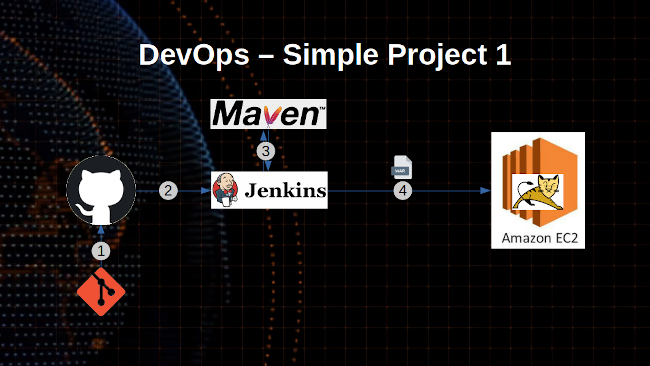

# Simple DevOps Project 1

In this project we are creating Jenkins CI CD of `git` > `github` > `jenkins` > `maven` to `build` war file > deploy to `tomcat 8 server` with `deploy to container` plugin.

**Prerequisites**

- EC2 instance with [tomcat 8 installed](../../Tomcat/tomcat8_installation.md)
- [Jenkins](../../Jenkins/Jenkins_installation.md) with [Maven](../../Maven/Maven_installation.md) Server
- [Deploy to container](#deploy_to_container) plugin installed
- [Setup Tomcat Credentials](#tomcat_credentials)

**Installation of `Deploy to container` plugin**

  - `Manage Jenkins` > `Jenkins Plugins` > `available` > `deploy to container`

**Setup credentials of Tomcat**

To deploy our build artifacts on tomcat server our Jenkins server need access. For that we should setup credentials. This option is available in `Jenkins Dashboard`.

- `Manage Jenkins` > `Manage Credentials` > Under `Stores scoped to Jenkins` on the right, click on `Jenkins`> Under `System`, click the `Global credentials (unrestricted)` link to access this default domain > Click `Add Credentials` on the left. >
    - From the `Kind field` choose `Username and password`
    - Username : `deployer`
    - Password : `XXXXXXX`
    - id : `Tomcat_user`
    - Description: `Tomcat user to deploy on tomcat server`

**Steps to create Jenkin job**

- Login to Jenkins console
- Create Jenkins job, Fill the following details,
  - Enter Item name: `Simple Devops Project 1`
    - `Maven Project`
  - Source Code Management:
    - Repository: `https://github.com/maheshkn400/hello-world.git`
    - Branches to build : */master`
  - Build:
    - Root POM:`pom.xml`
    - Goals and options : `clean install package`
  - Post Steps
    - Deploy war/ear to container
      - WAR/EAR files : `**/*.war`
      - Containers : `Tomcat 8.x`
        - Credentials: `Tomcat_user` # (which created in above step)
        - Tomcat URL : `http://<PRIVATE_IP>:<PORT_NO>`

Save and run the job now.

Ater success build and deploy check url as follows

~~~sh
<publid-ip>:8080/webapp
~~~
**Continuous Integration & Continuous Deployment (CI/CD)**

Now job is running fine but to make this as Continuous Integration and Continuous Deployment To do that go back and modify job as below.

- Build Triggers
  - Poll SCM
    - schedule */2 * * * *

Save the job and modify the code in GitHub. Then you could see your job get trigger a build without any manual intervention.

:warning: **Important** - For lab we done "Build Triggers" schedule every 2 min to trigger but in real time it is not recommended. It depends upon the appliation and client requirement. We will schedule it every night in non-production time or week ends or some projects it will set when any code commit / change in repository (master branch).

_I'm Happy To Get [Suggestions](https://forms.gle/UPiN8UrHikj9UR5UA)_ :smile:
