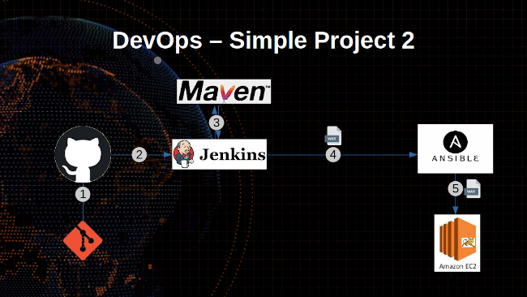

# Simple DevOps Project 2

In this project we are creating Jenkins CI CD of `git` > `github` > `jenkins` > `maven` to build and send `.war` file > to `ansible server` and deploy `.war` file with playbook > to  `tomcat 8 server`.

**Prerequisites**

- [Ansible server ](../../Ansible/Ansible_installation/)
- [Jenkins](../../Jenkins/Jenkins_installation.md) with [Maven](../../Maven/Maven_installation.md) Server
- [Tomcat Server](../../Tomcat/tomcat8_installation.md)
- Install [Publish Over SSH ](#publish_over_ssh) plugin
- [Enable connection between Ansible and Jenkins](enable_ssh)

**Install "Publish Over SSH"**

Login to Jenkins Dashboard >> `Manage Jenkins` > `Manage Plugins` > `Available` > `Publish over SSH`

**Enable connection between Ansible and Jenkins**

Login to Jenkins Dashboard >> `Manage Jenkins` > `Configure System` > `Publish Over SSH` > `SSH Servers`

- SSH Servers:
  - Name : `ansible_server`
  - Hostname:``<ServerIP>``
  - username: `ansadm`
  - password: `*******`

Test the connection by clicking `Test Connection` and save

**Create Playbooks**

Create dicrectory `playbooks` on `/opt`
~~~sh
mkdir /opt/playbooks
~~~
Create a `copywarfile.yml` playbook file under `/opt/playbooks` directory on Ansible server
~~~sh
# copywarfile.yml
---
- hosts: all
  become: true
  tasks:
    - name: copy jar/war onto tomcat servers
        copy:
          src: /opt/playbooks/wabapp/target/webapp.war
          dest: /usr/tomcat8/webapps
~~~

**Create `SSH key` and copy to `Tomcat server`**
 - Login to tomcat user and create `ansadm` user, set password and add to sudo
 ~~~sh
 sudo useradd ansadm
 sudo passwd ansadm
 sudo echo "ansadm ALL=(ALL:ALL) NOPASSWD: ALL" >> /etc/sudoers
 ~~~
 - Now login to `Ansible` server generate `SSH key` and copy to `tomcat` server
  ~~~sh
  ssh-keygen
  ssh-copy-id ansadm@<docker-host-IP>
  ~~~

Add tomcat server details to /etc/ansible/hosts (if you are using other hosts file update server info there)
~~~sh
echo "<tomcat-server_IP>" >> /etc/ansible/hosts
~~~

**Jenkins CI CD new item Setup**

Create Jenkins job, Fill the following details,

Login to Jenksing Dashboard > click `New Item`
  - Enter item name: `sample devops project 1`
   - Source Code Management:
    - Repository: `https://github.com/maheshkn400/hello-world.git`
    - Branches to build : `*/master`
  - Build:
    - Root POM:`pom.xml`
    - Goals and options : `clean install package`
  - Add post-build steps
    - Send files or execute commands over SSH
      - SSH Server : `ansible_server`
      - Source fiels: `webapp/target/*.war`
      - Remote directory: `//opt//playbooks`
  - Add post-build steps
    - Send files or execute commands over ssH
      - SSH Server : `ansible_server`
      - Exec command: `ansible-playbook /opt/playbooks/copywarfile.yml`

Run the job and you should be able to seen build has been deployed on Tomcat server.

_I'm Happy To Get [Suggestions](https://forms.gle/TbfdXQ5H3a3oSTjo6)_ :smile:
