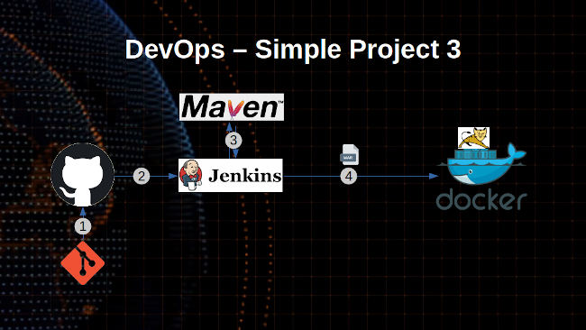

# Simple DevOps Project 3

**Pre-Requirments**

- [Jenkins](../../Jenkins/Jenkins_installation.md) with [Maven](../../Maven/Maven_installation.md) Server
- [Docker](../../Docker/installation/) host
- [Create user](#create_user) on Docker Host
- Install [Publish over ssh](#publish_over_ssh) Plugin
- [Enable connection](#enable_ssh) between Docker and Jenkins

**Create User On docker Host**

create a new user for Docker management and add user to Docker (default) group
~~~sh
useradd dockeradmin
passwd dockeradmin
usermod -aG docker dockeradmin
~~~
Creat `docker` directory under `/opt`
~~~sh
mkdir /opt/docker
~~~
Write a `Dockerfile` under `/opt/docker`
~~~sh
vi Dockerfile

# Pull base image
From tomcat:8-jre8
# Maintainer
MAINTAINER "maheshkumar.root@gmail.com"

# copy war file on to container
COPY ./webapp.war /usr/local/tomcat/webapps
~~~

**Install "publish Over SSH" plugin**

Jenkins Dashboard >> `Manage Jenkins` > `Manage Plugins` > `Available` > `Publish over SSH` and install.

**Enable connection between Docker and Jenkins**

Jenkins Dashboard >> `Manage Jenkins` > `Configure System` > `Publish Over SSH` > `SSH Servers`

- SSH Servers:
  - Name : `docker_host`
  - Hostname: `<ServerIP>`
  - username: `dockeradmin`
  - password: `*******`

Test the connection by clicking `Test Connection` and save

**Create Jenkins job**

Jenkins Dashboard >> click `New item`
- Enter item name: `Simple-Devops-Project-3`
  - Source Code Management  
    - Repository : `https://github.com/ValaxyTech/hello-world.git`
    - Branches to build : `*/master`
  - Build
    - Root POM: `pom.xml`  
    - Goals and options : `clean install package`  

  - Send files or execute commands over SSH
    - Name: `docker_host`
    - Source files	: `webapp/target/*.war`
    - Remove prefix	: `webapp/target`
    - Remote directory	: `//opt//docker`  
  - Exec command[s]	:
  ~~~sh
  docker stop mkn400_demo;
  docker rm -f mkn400_demo;
  docker image rm -f mkn400_demo_img;
  cd /opt/docker;
  docker build -t mkn400_demo_img .
  ~~~

  - send files or execute commands over SSH  
    - Name: `docker_host`  
    - Exec command	: `docker run -d --name mkn400_demo -p 8090:8080 mkn400_demo_img`  

Login to Docker host and check images and containers before run the job. (no images and containers)

Run Jenkins job

check images and containers again on Docker host. This time an image and container get creates through Jenkins job

Access web application from browser which is running on container
`http://<docker_host_Public_IP>:8090/webapp`
