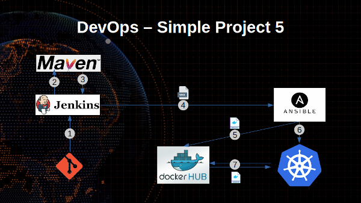

# Simple DevOps Project 5

In this project we are going to create Jenkins CI / CD to deploy `webapp.war` application to `kubernetes` server via `ansible playbooks`. It will create `tomcat` `docker` image with `webapp.war` file and push image to `docker hub` repo and pull from `kubernetes master server`.

## Pre-Requirments

Setup and Ready the following servers and account.

- [Jenkins server](../../Jenkins/Jenkins_installation.md) and [Maven](../../Maven/Maven_installation.md) install in single server.
- [Ansible server](../../Ansible/Ansible_installation)
- [Kubernetes server](../../Kubernetes/installation/install_kubernetes_cluster_on_aws_use_kops.md) with `kops` (works only on `AWS`)
- A [Docker Hub](https://hub.docker.com/  ) account and create `simple-devops-image` repository.

## Setup on kubernetes master servers
- Login to kubernete master server
- swith to `root` user
~~~sh
sudo su root
~~~
-Copy following file to `/root/` directory
  - [mkn400-deploy](./kubernetes-nodes/mkn400-deploy.yml)
  - [mkn400-service](./kubernetes-nodes/mkn400-service.yml)

## Setup on Ansible server

- Login to `ansible server` and copy `public key` onto `kubernetes cluseter master` account
- create a /opt/`k8s-lab` directory on it.
~~~sh
mkdir /opt/k8s-lab/
~~~
- Copy `hosts` to `/opt/k8s-lab/` file and Update new group called `0kubernetes` and add kubernetes master IP in that.

	- [hosts](./ansible-server/hosts)

- Copy following ansible playbooks files to `k8s-lab` directory.

	- [Dockerfile](./ansible-server/Dockerfile)
	- [create-simple-devops-image](./ansible-server/create-simple-devops-image.yml)
	- [kubernetes-mkn400-deployment](./ansible-server/kubernetes-mkn400-deployment.yml)
	- [kubernetes-mkn400-service](./ansible-server/kubernetes-mkn400-service.yml)

## Integration Kubernetes with Jenkins

##### Create "Deploy_on_Kubernetes_CI" Jenkin job
   - From Jenkins dashboard select `New Item`
   - Enter an item name: `Deploy_on_Kubernetes_CI`     

   - *Source Code Management:*
      - Repository: `https://github.com/maheshkn400/hello-world.git`
      - Branches to build : `*/master`

   - *Build*
     - Root POM:`pom.xml`
     - Goals and options: `clean install package`

   - *Post-build Actions*
     - Send build artifacts over SSH
       - *SSH Publishers*
        - SSH Server Name: `ansible-server`
         - `Transfers` >  `Transfer set`
             - Source files: `webapp/target/*.war`
	         - Remove prefix: `webapp/target`
	         - Remote directory: `//opt//k8s-lab`
	         - Exec command:
           ~~~sh
           ansible-playbook -i /opt/k8s-lab/hosts /opt/k8s-lab/create-simple-devops-image.yml --limit localhost;
           ~~~

Save and run the job.

##### Create "Deploy_on_Kubernetes_CD" Jenkin job

- From Jenkins home page select `New Item`
- Enter an item name: `Deploy_on_Kubernetes_CD`
- `Freestyle` Project
- *Post-build Actions*  
   - Send build artifacts over SSH  
     - *SSH Publishers*
       - SSH Server Name: `ansible-server`
       - Exec command:
        ~~~sh
        ansible-playbook -i /opt/k8s-lab/hosts /opt/k8s-lab/kubernetes-mkn400-deployment.yml;
        ansible-playbook -i /opt/k8s-lab/hosts /opt/k8s-lab/kubernetes-mkn400-service.yml;
        ~~~

Save and run the job.

Go Back To `configuration` of `Deploy_on_Kubernetes-CI` Job
  - *Post-build Actions*
    - `select run job`
      - `Deploy_on_Kubernetes-CD`
    - Check checkbox `trigger when stable`

Apply and Save

Before run `Deploy_on_Kubernetes-CI` job login to kubernetes master and check for pods, deployments and services on kubernetes master

~~~sh
kubectl get pods -o wide
kubectl get deploy -o wide
kubectl get service -o wide
~~~

And go to Jenkins `Deploy_on_Kubernetes-CI` job and run / build the job.

After success deploy access `https://<kubernetes-master-pubilc-ip>:31200/webapp` URL.

_I'm Happy To Get [Suggestions](https://forms.gle/UPiN8UrHikj9UR5UA)_ :smile:
