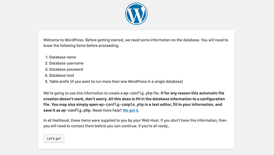

## Usage
Create directory name called 'wordpress' and change into the directory
~~~sh
mkdir wordpress
cd wordpress
~~~
Download the wordpress YAML file and rename it as docker-compose.YAML
~~~sh
wget https://github.com/maheshkn400/DevOps/raw/master/Docker/wordpress/wordpress.yml
mv wordpress.yml docker-compose.yml
~~~
Run the following command to create and up the containers with detach mode
~~~sh
docker compose up -d
~~~
Check the containers with `wordpress` name two containers available with port 80 expose
~~~sh
docker ps
~~~
access the url `http://(server name / ip)/` you will gat as follow.

And follow the WordPress instructions to install.

Down the containers
~~~sh
docker compose down
~~~
Up the containers with detach mode
~~~sh
docker compose up -d
~~~
