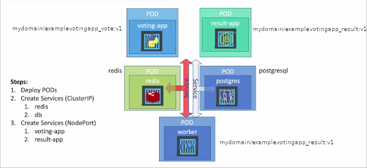

# Example voting-app project
This is based on the original [example-voting-app](https://github.com/dockersamples/example-voting-app) from docker-examples (https://github.com/dockersamples)

modified to work on Kubernetes

* A front-end web app in Python or ASP.NET Core which lets you vote between two options
* A Redis or NATS queue which collects new votes
* A .NET Core, Java or .NET Core 2.1 worker which consumes votes and stores them in…
* A Postgres or TiDB database backed by a Docker volume
* A Node.js or ASP.NET Core SignalR webapp which shows the results of the voting in real time

**Run the app in Kubernetes**

Download voting-app folder it contains the yaml specifications of the Voting App's services.

First create the vote namespace
~~~sh
$ kubectl create namespace vote
~~~
Run the following command to create the deployments and services objects:
~~~sh
$ kubectl create -f voting-app/
~~~
The vote interface is then available on port 31000 on each host of the cluster, the result one is available on port 31001.
