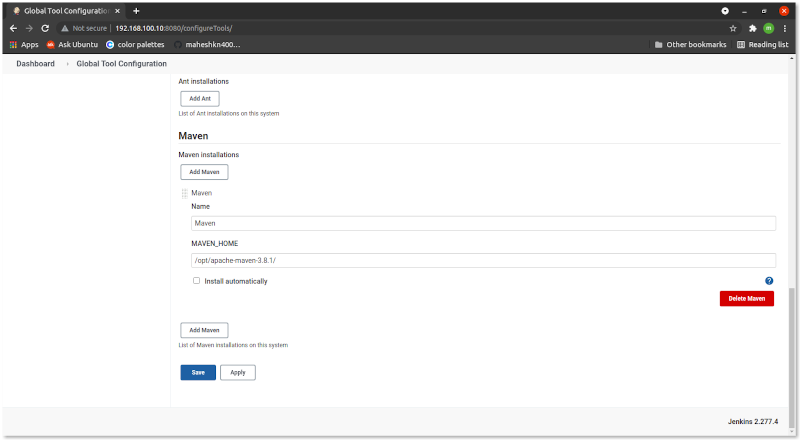

# Installation of Maven
:yellow_circle: NOTE: I'm install to use on jenkins so I'm install on jenkins server :yellow_circle:
### Installaion JDK 8
~~~sh
[root@jenkins ] yum -y install java-1.8.0-openjdk java-1.8.0-openjdk-devel
[root@jenkins ] cat > /etc/profile.d/java8.sh <<EOF
export JAVA_HOME=$(dirname $(dirname $(readlink $(readlink $(which javac)))))
export PATH=\$PATH:\$JAVA_HOME/bin
export CLASSPATH=.:\$JAVA_HOME/jre/lib:\$JAVA_HOME/lib:\$JAVA_HOME/lib/tools.jar
EOF
[root@jenkins ] source /etc/profile.d/java8.sh
~~~
 If another version of JDK had been installed, change the default like follows.
~~~sh
[root@jenkins ] alternatives --config java
There are 2 programs which provide 'java'.

  Selection    Command
-----------------------------------------------
   1           /usr/java/jdk1.8.0_71/jre/bin/java

 select the latest one
Enter to keep the current selection[+], or type selection number: 1
~~~
Create a `test` program and make sure it works normally.
~~~sh
[root@jenkins ] vi day.java

import java.util.Calendar;

class day {
    public static void main(String[] args) {
        Calendar cal = Calendar.getInstance();
        int year = cal.get(Calendar.YEAR);
        int month = cal.get(Calendar.MONTH) + 1;
        int day = cal.get(Calendar.DATE);
        int hour = cal.get(Calendar.HOUR_OF_DAY);
        int minute = cal.get(Calendar.MINUTE);
        System.out.println(year + "/" + month + "/" + day + " " + hour + ":" + minute);
    }
}
~~~
compile and run
~~~sh
[root@jenkins ] javac day.java
[root@jenkins ] java day
2021/5/08 20:37
~~~
### Now Installation of Maven
Download and unzip the Maven zip file to `/opt` location
~~~sh
[root@jenkins ] cd /opt
[root@jenkins ] wget https://downloads.apache.org/maven/maven-3/3.8.1/binaries/apache-maven-3.8.1-bin.zip
[root@jenkins ] unzip apache-maven-3.8.1-bin.zip
[root@jenkins ] ls
apache-maven-3.8.1
~~~
Add the `bin` directory of the created directory `apache-maven-3.8.1` to the `PATH` environment variable
~~~sh
[root@jenkins ] cat > /etc/profile.d/maven.sh <<EOF
export PATH=/opt/apache-maven-3.8.1/bin:$PATH
EOF
[root@jenkins ] source /etc/profile.d/maven.sh
~~~
or logout and login user

Confirm with `mvn -v` in a new shell. The result should look like as follows
~~~sh
[root@jenkins ] mvn -v
Apache Maven 3.8.1 (0ec48eb515d93f8515d4abe465570dfded6fa13a3ceb9aab8031428442d9912ec20f066b2afbf56964ffe1ceb56f80321b50db73cf77a0e2445ad0211fb8e38d)
Maven home: /opt/apache-maven-3.8.1
Java version: 1.8.0_71, vendor: Oracle Corporation
Java home: /usr/java/jdk1.8.0_71/jre/
Default locale: en_US, platform encoding: UTF-8
~~~

### Integrate Maven on Jenkins
Jenkins Dashboard >> `Manage Jenkins` > `Global Tool Configuration` > `Maven` > click `JDK installations` button
- Name: `Maven`
- MAVEN_HOME: `/opt/apache-maven-3.8.1/`
- click apply and save

:arrow_right: [Maven](../Maven) or [DevOps  :house: ](https://github.com/maheshkn400/DevOps/)
