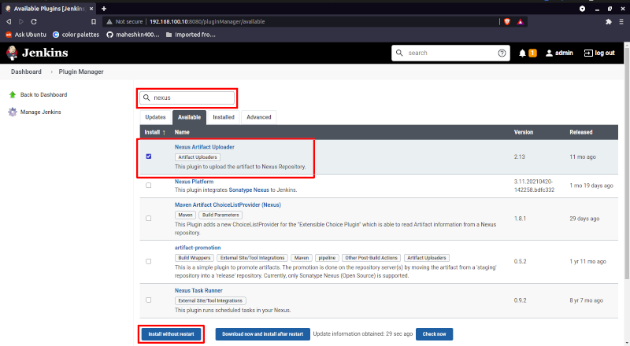
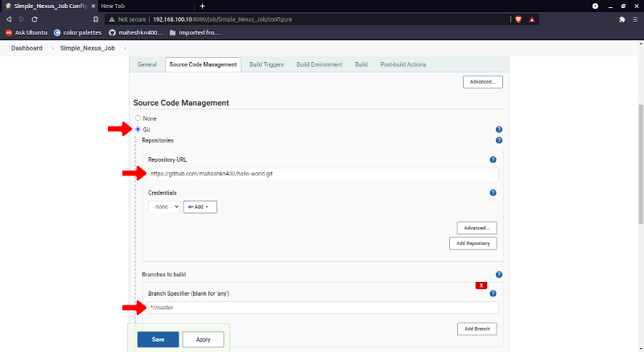
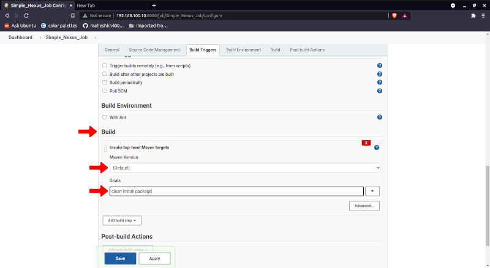
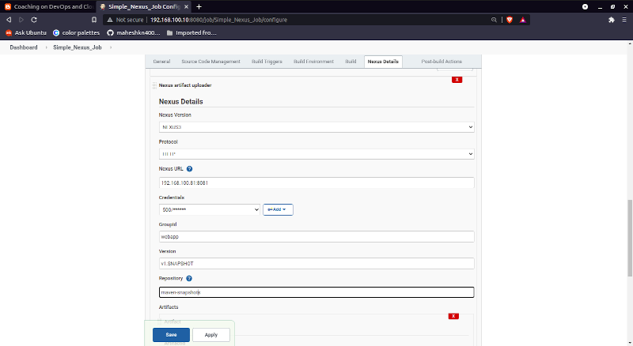
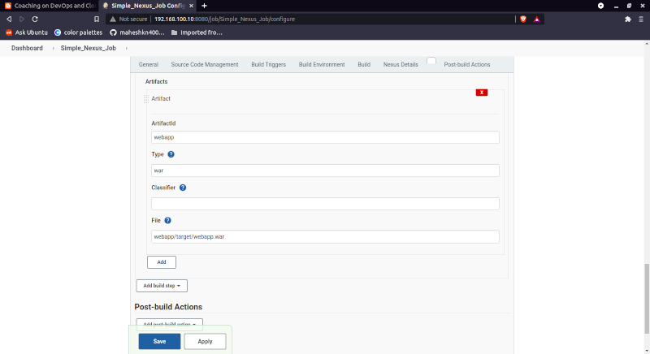
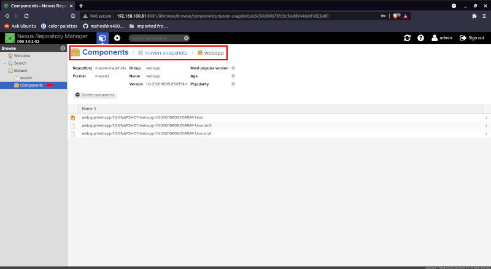

# Nexus Repository Integration With Jenkins

### Install Nexus Repository Plugin on Jenkins

- Jenkins Dashboard >> `Manage Jenkins` > `Manage plugins` > click `Available` tab and search for `Nexus Artifact Uploader` and click `install without restart` button.

### Create Sample Jenkins Job To Test

- Jenkins Dashboard >> `New Item`
  - Enter Item Name: `Sample_Nexus_Job`
  - Select `Freetyle Project` and click `ok` button
  - Select `Source Code Management` Tab
    - select `Git`
      - Repository URL : `https://github.com/maheshkn400/hello-world.git`
      - Branches to build: `*/master`

  

  - select `Build` Tab
    - From `Add build setup` > select `Invoke top-level Maven targets`
      - Maven Verions `Maven`
      - Goals `clean install package`

  - select `Build` Tab
    - From `Add build setup` > select `Nexus Artifact Uploader` > `Nexus Details`
      - Nexus Version : `NEXUS3`
      - Protocol : `HTTP`
      - Nexus URL : `<nexus_repository_IP>:8081`
      - Credentials : select credentials from scrollbar or add new
      - GroupID : `webapp`
      - verions: `1.0-SNAPSHOT`
      - Repository: `maven-snapshots`

  - select `Build` Tab
      - From `Add build setup` > select `Nexus Artifact Uploader` > `Nexus Details` > `Artifacts`
        - Artifactid : webapp
        - Type : `war`
        - File : `webapp/target/webapp.war`

  

*Click `Apply` and `save`* and `run` the job

Access `http://<nexus-server-ip>:8081` or url and login check the `war` file SNAPSHOT as follows

_I'm Happy To Get [Suggestions](https://forms.gle/TbfdXQ5H3a3oSTjo6)_ :smile:
