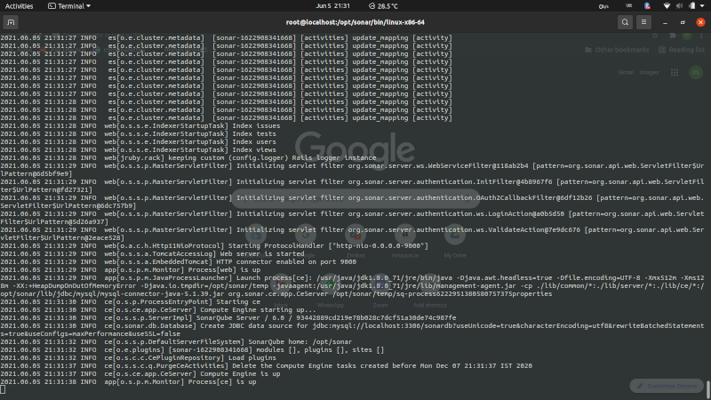

# SonarQube Installation

### Prerequisites
1. [Install OpenJDK 8](#openjdk8_install)
1. [MySQL 5.x Install](#mysql) and [Database Create](#database)

### Installation OpenJDK 8

Install OpenJDK 8
~~~sh
yum -y install java-1.8.0-openjdk java-1.8.0-openjdk-devel
cat > /etc/profile.d/java8.sh <<EOF
export JAVA_HOME=$(dirname $(dirname $(readlink $(readlink $(which javac)))))
export PATH=\$PATH:\$JAVA_HOME/bin
export CLASSPATH=.:\$JAVA_HOME/jre/lib:\$JAVA_HOME/lib:\$JAVA_HOME/lib/tools.jar
EOF
source /etc/profile.d/java8.sh
~~~
If another version of JDK had been installed, change the default like follows.
~~~sh
alternatives --config java
#output it as below and select version as shown
There are 2 programs which provide 'java'.

  Selection    Command
-----------------------------------------------
   1           /usr/lib/jvm/java-1.8.0-openjdk-1.8.0.102-1.b14.el7.x86_64/jre/bin/java

Enter to keep the current selection[+], or type selection number: 1
~~~
Create a test program and make sure if it works normally.
~~~sh
 vi day.java
import java.util.Calendar;

class day {
    public static void main(String[] args) {
        Calendar cal = Calendar.getInstance();
        int year = cal.get(Calendar.YEAR);
        int month = cal.get(Calendar.MONTH) + 1;
        int day = cal.get(Calendar.DATE);
        int hour = cal.get(Calendar.HOUR_OF_DAY);
        int minute = cal.get(Calendar.MINUTE);
        System.out.println(year + "/" + month + "/" + day + " " + hour + ":" + minute);
    }
}
~~~
compile
~~~sh
javac day.java
~~~
run
~~~sh
java day
# output
2021/05/304 19:46
~~~

### MySQL 5.x Installation
Download, install and enable mysql 5.7 [repo](https://dev.mysql.com/downloads/repo/yum/) for your linux destro
~~~sh
yum install wget unzip -y
wget https://dev.mysql.com/get/mysql80-community-release-el7-3.noarch.rpm
rpm -Uvh mysql80-community-release-el7-3.noarch.rpm
rpm --import /etc/pki/rpm-gpg/*
# mysql 5.7 repo enable
yum-config-manager --disable mysql0-community
yum-config-manager --enable mysql57-community
~~~
Install mysql package
~~~sh
yum install mysql-community
~~~
start the mysql service
~~~sh
systemctl start mysqld
~~~
OR
~~~sh
service mysqld Start
~~~
get the mysql `root` password
~~~sh
grep 'temporary password' /var/log/mysqld.log
~~~
execute `mysql_secure_installation` and follow the steps and change root password
~~~sh
mysql_secure_installation
~~~

### Create sonarqube database

Install MySQL client to connect and create DataBase for sonarqube
~~~sh
yum install mysql
~~~
Allow RDS instance security group to access SonarQube server

Connect to RDS instance with database credentials
~~~sh
mysql -h <MYSQL_SERVER_IP>:3306 -u root -p
password:
~~~
Create a new database for sonarqube
~~~sh
CREATE DATABASE sonardb CHARACTER SET utf8 COLLATE utf8_general_ci;
~~~
Create a local and a remote user for new database
~~~sh
CREATE USER sonaruser@localhost IDENTIFIED BY 'SonarPass';
CREATE USER sonaruser@'%' IDENTIFIED BY 'SonarPass';
~~~
Grant database access permissions to users
~~~sh
GRANT ALL ON sonaruser.* TO sonardb@localhost;
GRANT ALL ON sonaruser.* TO sonardb@'%';
~~~
check users and databases
~~~sh
use mysql
show databases;
SELECT User FROM mysql.user;
FLUSH PRIVILEGES;
QUIT
~~~

So for you have configured required database information on RDS. Let’s Jump back to your EC2 instance and enable SonarQube properties file to connect his Database.

### ON SonarQube server (EC2)
Download stable SonarQube version from below website.
- Website: https://www.sonarqube.org/downloads/
- Note: This Article written for SonarQube6.0  

Download & unzip SonarQube 6.0
~~~sh
cd /opt
wget https://sonarsource.bintray.com/Distribution/sonarqube/sonarqube-6.0.zip
unzip sonarqube-6.0.zip
mv /opt/sonarqube-6.0 /opt/sonar
~~~
if `unzip` not availab installed it as follow
~~~sh
yum install unzip -y
~~~
Edit sonar properties file to uncomment and provide required information for below properties.
~~~SH
vi /opt/sonar/conf/sonar.properties
  sonar.jdbc.username=`sonaruser`
  sonar.jdbc.password=`SonarPass`
  sonar.jdbc.url=jdbc:mysql://`<MYSQL_SERVER_IP>:3306`/sonardb?useUnicode=true&characterEncoding=utf8&rewriteBatchedStatements=true&useConfigs=maxPerformance&useSSL=false
  sonar.web.host=`0.0.0.0`
  sonar.web.context=`/sonar`
~~~
Start SonarQube service
~~~sh
cd /opt/sonar/bin/linux-x86-64/
./sonar.sh start
~~~
When start service first time it will take little bit time to up and run the service after creating database tables as follows and wait upto `computer engine is up` from `/opt/sonar/log/` log.

##### Add SonarQube service to systemd settings

Copying `sonar.sh` to `/etc/init.d/sonar` and modify it according to your platform.
~~~sh
sudo cp /opt/sonar/bin/linux-x86-64/sonar.sh /etc/init.d/sonar
sudo vi /etc/init.d/sonar
~~~
Add below values to your `/etc/init.d/sonar` file
~~~sh
#Insert/modify below values
SONAR_HOME=/opt/sonar
PLATFORM=linux-x86-64

WRAPPER_CMD="${SONAR_HOME}/bin/${PLATFORM}/wrapper"
WRAPPER_CONF="${SONAR_HOME}/conf/wrapper.conf"
PIDDIR="/var/run"
~~~
Start SonarQube server
~~~sh
service sonar start
~~~
SonarQube application uses port 9000. access SonarQube from browser
`http://<sonarqube_server_PUBLIC_IP>:9000/sonar`

###  Troubleshooting

1. Check whether you enabled port 9000 in EC2 instance security group
2. Check whether you enabled EC2 instance IP range in RDS security group
3. If you using RHEL or CentOS check the firewalld port allow on both servers

### Next Step
- [x] [Integrate SonarQube with Jenkins](./integrate_sonarqube_on_jenkins.md)

### Resource
[MYSQL INSTALLATION](https://dev.mysql.com/doc/mysql-installation-excerpt/5.7/en/)

_I'm Happy To Get [Suggestions](https://forms.gle/TbfdXQ5H3a3oSTjo6)_ :smile:
