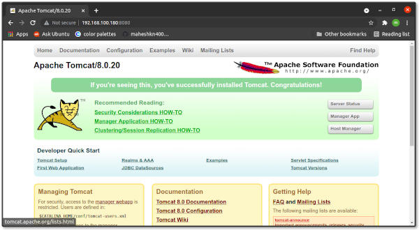

# Installation of Tomcat 8
## Installaion JDK 8
~~~sh
[root@tomcat8 ] yum -y install java-1.8.0-openjdk java-1.8.0-openjdk-devel
[root@tomcat8 ] cat > /etc/profile.d/java8.sh <<EOF
export JAVA_HOME=$(dirname $(dirname $(readlink $(readlink $(which javac)))))
export PATH=\$PATH:\$JAVA_HOME/bin
export CLASSPATH=.:\$JAVA_HOME/jre/lib:\$JAVA_HOME/lib:\$JAVA_HOME/lib/tools.jar
EOF
[root@tomcat8 ] source /etc/profile.d/java8.sh
~~~
If another version of JDK had been installed, change the default like follows.
~~~sh
[root@tomcat8 ] alternatives --config java
There are 2 programs which provide 'java'.

  Selection    Command
-----------------------------------------------
   1           /usr/java/jdk1.8.0_71/jre/bin/java

# select the latest one
Enter to keep the current selection[+], or type selection number: 1
~~~
Create a test program and make sure if it works normally.
~~~sh
[root@tomcat8 ] vi day.java

import java.util.Calendar;

class day {
    public static void main(String[] args) {
        Calendar cal = Calendar.getInstance();
        int year = cal.get(Calendar.YEAR);
        int month = cal.get(Calendar.MONTH) + 1;
        int day = cal.get(Calendar.DATE);
        int hour = cal.get(Calendar.HOUR_OF_DAY);
        int minute = cal.get(Calendar.MINUTE);
        System.out.println(year + "/" + month + "/" + day + " " + hour + ":" + minute);
    }
}
~~~
compile and run
~~~sh
[root@tomcat8 ] javac day.java
[root@tomcat8 ] java day
2021/5/08 20:37
~~~
## Now Time to Installation of Tomcat 8
Download , unzip and move the tomcat 8
~~~sh
[root@tomcat8 ] wget https://archive.apache.org/dist/tomcat/tomcat-8/v8.0.20/bin/apache-tomcat-8.0.20.tar.gz
[root@tomcat8 ] tar zxvf apache-tomcat-8.0.20.tar.gz
[root@tomcat8 ] mv apache-tomcat-8.0.20 /usr/tomcat8
~~~
Create user for tomcat and grand permission to `/usr/tomcat8`
~~~sh
[root@tomcat8 ] useradd -M -d /usr/tomcat8 tomcat8
[root@tomcat8 ] chown -R tomcat8. /usr/tomcat8
~~~
Create a Systemd Setting file to start and stop tomcat service with `service` or `systemctl` commands.
~~~sh
[root@tomcat8 ] vi /usr/lib/systemd/system/tomcat8.service
# create new
[Unit]
Description=Apache Tomcat 8
After=network.target

[Service]
Type=oneshot
ExecStart=/usr/tomcat8/bin/startup.sh
ExecStop=/usr/tomcat8/bin/shutdown.sh
RemainAfterExit=yes
User=tomcat8
Group=tomcat8

[Install]
WantedBy=multi-user.target
~~~
Now Start and enable the tomcat8 systemd service
~~~sh
[root@tomcat8 ] systemctl start tomcat8
[root@tomcat8 ] systemctl enable tomcat8
~~~
open the web browers and access website ``http://(server's hostname or IP address):8080/``

Create a test servlet that shows current day and time and make sure if it works normally.
~~~sh
[root@tomcat8 ] mkdir /usr/tomcat8/webapps/ROOT/WEB-INF/classes
[root@tomcat8 ] chown tomcat8. /usr/tomcat8/webapps/ROOT/WEB-INF/classes
[root@tomcat8 ] cd /usr/tomcat8/webapps/ROOT/WEB-INF/classes
[root@tomcat8 ] vi daytime.java
import java.io.*;
import javax.servlet.*;
import javax.servlet.http.*;
import java.util.Calendar;

public class daytime extends HttpServlet {
    public void doGet(HttpServletRequest request
    ,HttpServletResponse response)

    throws IOException, ServletException{
        response.setContentType("text/html");
        PrintWriter out = response.getWriter();
        Calendar cal = Calendar.getInstance();
        out.println("<html>\n<head>\n<title>DayTime</title>\n</head>\n<body>");
        out.println("
");
        out.println(cal.get(Calendar.YEAR) + "/" + (cal.get(Calendar.MONTH) + 1) + "/" +
        cal.get(Calendar.DATE) + " " + cal.get(Calendar.HOUR_OF_DAY) + ":" + cal.get(Calendar.MINUTE));
        out.println("
\n</body>\n</html>");
    }
}
~~~
Configure on tomcat configuration files
~~~sh
[root@tomcat8 ] javac -classpath /usr/tomcat8/lib/servlet-api.jar daytime.java
[root@tomcat8 ] vi /usr/tomcat8/webapps/ROOT/WEB-INF/web.xml
# add follows between <web-app> - </web-app>
  <servlet>
     <servlet-name>daytime</servlet-name>
     <servlet-class>daytime</servlet-class>
  </servlet>
  <servlet-mapping>
     <servlet-name>daytime</servlet-name>
     <url-pattern>/daytime</url-pattern>
  </servlet-mapping>
~~~
Access to ``http://(server's hostname or IP address):8080/daytime`` to make sure it works normally.

### Create Tomcat User
adding following lines to ``/usr/tomcat8/config/tomcat-users.xml`` in between ``<tomcat-users> .... </tomcat-users>`` tags
~~~sh
[root@tomcat8 ]vi /usr/tomcat8/config/tomcat-users.xml
	<role rolename="manager-gui"/>
	<role rolename="manager-script"/>
	<role rolename="manager-jmx"/>
	<role rolename="manager-status"/>
	<user username="admin" password="admin" roles="manager-gui, manager-script, manager-jmx, manager-status"/>
	<user username="deployer" password="deployer" roles="manager-script"/>
	<user username="tomcat" password="s3cret" roles="manager-gui"/>
~~~
In above `deployer` user will use on jenkins

Restart the tomcat service
~~~sh
[root@tomcat8 ] service tomcat8 stop
[root@tomcat8 ] service tomcat8 start
~~~

:arrow_right: [Tomcat](../Tomcat) or [DevOps  :house: ](https://github.com/maheshkn400/DevOps/)
